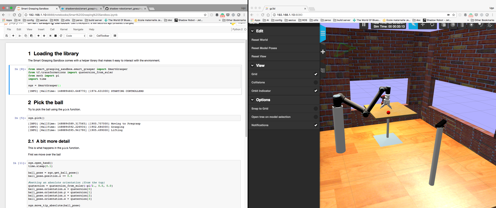

| Check  | Status |
|---------------|--------|
| Docker | [](https://hub.docker.com/r/shadowrobot/smart_grasping_sandbox) |
| Landscape | [](https://landscape.io/github/shadow-robot/smart_grasping_sandbox/master) |

# smart_grasping_sandbox

This is a public simulation sandbox for [Shadow's Smart Grasping System](https://www.shadowrobot.com/shadow-smart-grasping-system/). We're aiming to provide you with a simplified simulation environment to play with different challenges in an autonomous pick and place problem.

This stack contains:
* **doc**: some additional documentation
* **fh_description**: the urdf description of the robot
* **smart_grasp_moveit_config**: a MoveIt! config for the motion planning
* **smart_grasping_sandbox**: the main point of entrance, includes the launch file and the main python files.



## Getting started

The fastest way to get started is using Docker. If you haven't done so already head over to the [Docker website](https://www.docker.com/) and follow the instructions over there. Once installed you can simply fire up the pre-built Docker container (it will be downloaded automatically for you):

```
docker run -it --name sgs -p 8080:8080 -p 8888:8888 -p 8181:8181 -p 7681:7681 shadowrobot/smart_grasping_sandbox
```

Then connect your local browser to [localhost:8080](http://localhost:8080) to see the simulation and [localhost:8888](http://localhost:8888) to get access to an ipython notebook which you can tinker with. The password for the ipython notebook is `shadow`.

The [ipython notebook](http://localhost:8888) contains an example of interaction with the sandbox to help you get started. If you want to check which functions are available in the `SmartGrasper` helper library, you can run from python:

```python
from smart_grasping_sandbox.smart_grasper import SmartGrasper
help(SmartGrasper)
```

## Restarting the container

The next time you want to restart this container you just have to run:

```
docker start sgs
```

And you will be able to connect to [localhost:8080](http://localhost:8080) and [localhost:8888](http://localhost:8888) again.

## More advanced use

A Cloud9IDE editor is also available for the more advanced user on [localhost:8181](http://localhost:8181).
